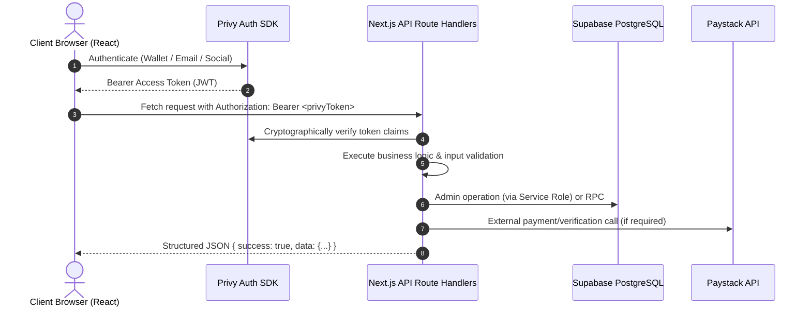
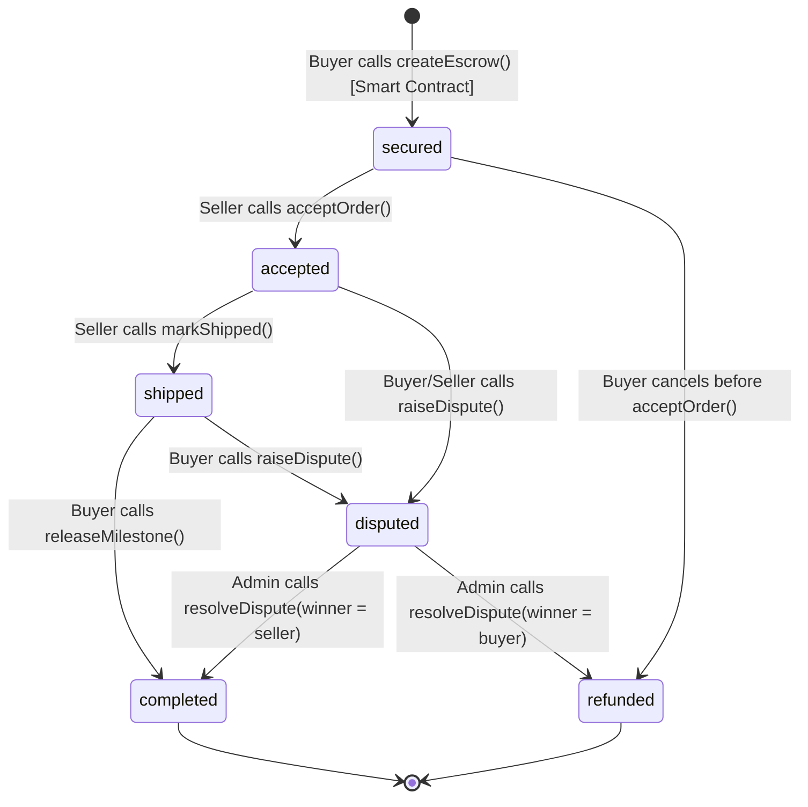
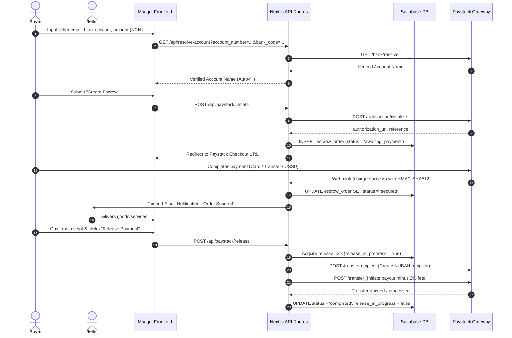
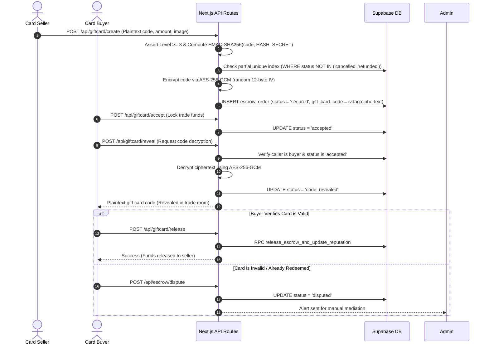
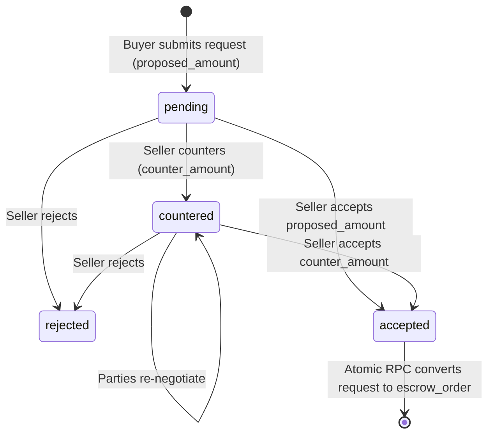
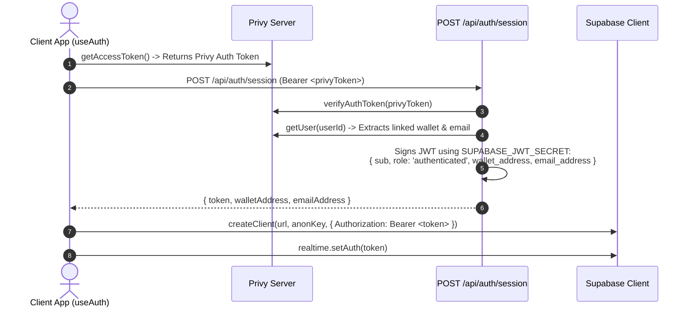
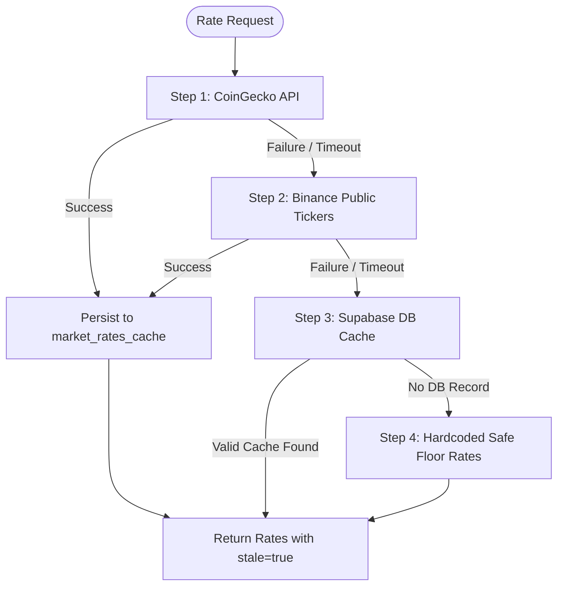
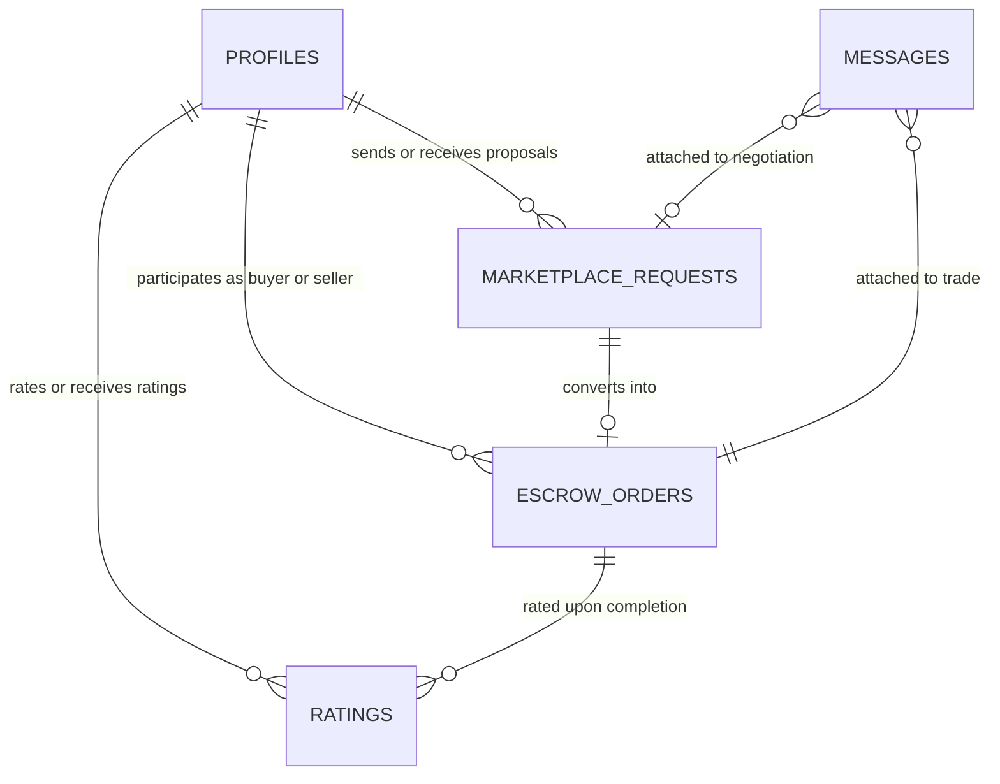

# TrustLink Protocol & Macqet Portal — System Architecture & Technical Specification

> **Document Version:** 2.0.0  
> **Last Updated:** September 2026  
> **Classification:** Official Technical Documentation  
> **Repository:** [willstanelson/TrustLink](https://github.com/willstanelson/TrustLink)  
> **Legal Entity:** TrustLink Software Firm (CAC: 9499334)  

---

## Table of Contents

1. [High-Level System Architecture & Tech Stack](#1-high-level-system-architecture--tech-stack)
   - [Core Dependencies & Runtime](#11-core-dependencies--runtime)
   - [Domain Architecture & Host-Based Routing](#12-domain-architecture--host-based-routing)
   - [Next.js App Router Structure](#13-nextjs-app-router-structure)
   - [Client-Server Interaction Model](#14-client-server-interaction-model)
2. [Escrow Lifecycles & State Machines](#2-escrow-lifecycles--state-machines)
   - [Universal Order Status Matrix](#21-universal-order-status-matrix)
   - [Lifecycle A: On-Chain Crypto Escrows](#22-lifecycle-a-on-chain-crypto-escrows)
   - [Lifecycle B: Fiat (NGN) Bank Transfer Escrows](#23-lifecycle-b-fiat-ngn-bank-transfer-escrows)
   - [Lifecycle C: Encrypted Gift Card Escrows](#24-lifecycle-c-encrypted-gift-card-escrows)
   - [Lifecycle D: Bendansalet Marketplace Negotiations](#25-lifecycle-d-bendansalet-marketplace-negotiations)
3. [Authentication, Identity & Web3 Infrastructure](#3-authentication-identity--web3-infrastructure)
   - [Privy Authentication & Embedded Wallets](#31-privy-authentication--embedded-wallets)
   - [Hybrid Identity Minting: Privy to Supabase JWT](#32-hybrid-identity-minting-privy-to-supabase-jwt)
   - [Supported EVM Blockchains & RPC Topology](#33-supported-evm-blockchains--rpc-topology)
   - [Smart Contract Architecture & ABI](#34-smart-contract-architecture--abi)
4. [Backend API Routes & External Integrations](#4-backend-api-routes--external-integrations)
   - [Comprehensive API Route Catalog](#41-comprehensive-api-route-catalog)
   - [Paystack Payment Gateway Integration](#42-paystack-payment-gateway-integration)
   - [Multi-Provider Currency Rates Waterfall](#43-multi-provider-currency-rates-waterfall)
   - [Dojah Identity & KYC Verification](#44-dojah-identity--kyc-verification)
   - [Environment Variables & Security Boundaries](#45-environment-variables--security-boundaries)
5. [Database Schema & Data Models](#5-database-schema--data-models)
   - [Entity Relationship Overview](#51-entity-relationship-overview)
   - [Table Schemas & Column DDL](#52-table-schemas--column-ddl)
   - [Atomic Database RPC Functions](#53-atomic-database-rpc-functions)
   - [Row Level Security (RLS) Policies](#54-row-level-security-rls-policies)
6. [Dispute Resolution, Risk & Administration](#6-dispute-resolution-risk--administration)
   - [Dispute Raising & Notification Protocol](#61-dispute-raising--notification-protocol)
   - [Admin Panel & Resolution Actions](#62-admin-panel--resolution-actions)
   - [Account Nuking & Strike Escalation System](#63-account-nuking--strike-escalation-system)
7. [FAQ & User-Facing Knowledge Extraction](#7-faq--user-facing-knowledge-extraction)
   - [Fund Protection & Security Mechanisms](#71-fund-protection--security-mechanisms)
   - [KYC Tier Progression & Transaction Limits](#72-kyc-tier-progression--transaction-limits)
   - [Supported Digital Tokens & Nigerian Banks](#73-supported-digital-tokens--nigerian-banks)
   - [Dispute Handling & Resolution Steps](#74-dispute-handling--resolution-steps)

---

## 1. High-Level System Architecture & Tech Stack

TrustLink is a hybrid Web2/Web3 escrow and marketplace protocol designed to facilitate trustless peer-to-peer commerce, freelance service agreements, digital card exchange, and fiat bank payouts.

```
                  ┌─────────────────────────────────────────────────────────┐
                  │                 DNS / Edge Ingress                      │
                  │   trustlink.com.ng           macqet.trustlink.com.ng    │
                  └────────────┬────────────────────────────┬───────────────┘
                               │                            │
                               ▼                            ▼
                  ┌──────────────────────┐    ┌─────────────────────────────┐
                  │  Marketing Landing   │    │     Macqet Portal (App)     │
                  │     (Public UI)      │    │  (Authenticated Route Group)│
                  └──────────────────────┘    └─────────────┬───────────────┘
                                                            │
                     ┌──────────────────────────────────────┴──────────────────────────────────────┐
                     │                                                                             │
                     ▼                                                                             ▼
    ┌─────────────────────────────────┐                                           ┌─────────────────────────────────┐
    │     Web3 / Smart Contracts      │                                           │       Serverless API Routes     │
    │  - EVM Chains (Plasma, Base,    │                                           │  - Next.js 16 Route Handlers    │
    │    Polygon, BSC, OP, Sepolia)   │                                           │  - Node.js Runtime              │
    │  - Viem 2 / Wagmi 2             │                                           │  - Privy Server Auth Token Guard│
    │  - TrustLinkEscrow.sol          │                                           └────────────────┬────────────────┘
    └─────────────────────────────────┘                                                            │
                                         ┌─────────────────────────────────────────────────────────┴────────────────┐
                                         │                                                                          │
                                         ▼                                                                          ▼
                      ┌──────────────────────────────────────┐                                   ┌──────────────────────────────────────┐
                      │          Database & Realtime         │                                   │          External Rail Integrations  │
                      │  - Supabase PostgreSQL               │                                   │  - Paystack (NUBAN / Transfers)      │
                      │  - Row Level Security (RLS)          │                                   │  - Dojah (vNIN / BVN / CAC)          │
                      │  - Custom Minted JWT Claims          │                                   │  - Resend (Transactional Email)      │
                      │  - Upstash Redis Rate Limiter        │                                   │  - CoinGecko / Binance Rate Oracles  │
                      └──────────────────────────────────────┘                                   └──────────────────────────────────────┘
```

### 1.1 Core Dependencies & Runtime

| Component | Technology | Version | Purpose |
| :--- | :--- | :--- | :--- |
| **Framework** | Next.js (App Router) | `16.1.1` | Full-stack server rendering, serverless route handlers, static generation |
| **Bundler** | Webpack | `--webpack` | Explicitly configured in build scripts for compatibility with cryptographic/Web3 libraries |
| **UI Library** | React / React-DOM | `19.2.3` | React 19 concurrent client components, state hooks, and streaming |
| **Styling** | Tailwind CSS / PostCSS | `^4.0.0` | Utility-first responsive CSS styling with dark palette design tokens |
| **Icons & Motion** | Lucide React / Framer Motion | `^0.562.0` / `^12.42.2` | Clean vector iconography and micro-animations |
| **Web3 Identity** | `@privy-io/react-auth` | `^3.10.1` | Social logins (Google, Apple, Discord), email OTP, embedded Ethereum wallets |
| **Server Auth** | `@privy-io/server-auth` | `^1.32.5` | Cryptographic verification of client authorization tokens in backend handlers |
| **Web3 Client** | Viem / Wagmi | `^2.44.4` / `^2.19.5` | Type-safe Ethereum client, contract reads/writes, account management |
| **Wagmi Connector** | `@privy-io/wagmi` | `^3.0.0` | Seamless bridge between Privy embedded wallets and Wagmi hook context |
| **Database** | `@supabase/supabase-js` | `^2.90.1` | PostgreSQL database interaction, Supabase Realtime subscriptions |
| **SSR Cookie DB** | `@supabase/ssr` | `^0.10.2` | Server-Side Supabase client helpers |
| **Rate Limiting** | `@upstash/ratelimit` / `@upstash/redis` | `^2.0.8` / `^1.38.0` | Distributed sliding-window API rate limiting on KYC and auth endpoints |
| **P2P Messaging** | `@xmtp/browser-sdk` / `@xmtp/xmtp-js` | `^6.1.2` / `^13.0.4` | End-to-end encrypted wallet-to-wallet chat |
| **Email Gateway** | Resend | `^6.9.4` | Transactional email alerts for secured escrows, releases, and disputes |
| **Schema Validation** | Zod | `^3.22.0` | Runtime validation for inbound API payloads and database parameters |

### 1.2 Domain Architecture & Host-Based Routing

The application utilizes Next.js edge middleware (`middleware.ts`) to provide clean domain isolation between the marketing website and the authenticated web application:

1. **`trustlink.com.ng` (Public Marketing Host):**
   - Serves the high-converting landing page at `/`.
   - Any request hitting `/dashboard` or `/dashboard/*` receives an automatic **308 Permanent Redirect** to `https://macqet.trustlink.com.ng/escrow`.
   - Access to any portal route (`/escrow`, `/marketplace`, `/profile`, `/admin`, `/support`, `/user`, `/trade`) on the root domain is immediately redirected to `macqet.trustlink.com.ng`.

2. **`macqet.trustlink.com.ng` (Macqet Portal Host):**
   - Serves the authenticated portal route group `(macqet)`.
   - Accessing the root path `/` on this subdomain is internally rewritten to `/escrow`.

3. **Universal Ingress (`/api/*` and `localhost`):**
   - All `/api/*` endpoints pass through untouched regardless of hostname, allowing client components and external webhooks (e.g. Paystack) to reach routes uniformly.
   - Development environments (`localhost`, `127.0.0.1`) bypass host validation entirely.

### 1.3 Next.js App Router Structure

```
app/
├── (macqet)/                  # Authenticated Portal Route Group (Subdomain: macqet.trustlink.com.ng)
│   ├── layout.tsx             # Portal shell: Sidebar navigation, wallet pills, network dropdown
│   ├── escrow/page.tsx        # Escrow Dashboard: Metric ribbons, trade tables, Create Escrow modal
│   ├── marketplace/           # Bendansalet Marketplace: Directory, vendor discovery, requests
│   │   ├── page.tsx           # Vendor directory with category and geo-proximity filters
│   │   ├── onboard/page.tsx   # Vendor application & verification onboarding
│   │   ├── requests/page.tsx  # Marketplace negotiation requests inbox
│   │   └── vendor/[address]/  # Individual public vendor storefront & reputation card
│   ├── profile/page.tsx       # Profile & Hub: Balances, Paystack bank payout setup, KYC modals
│   ├── trade/[orderId]/page.tsx # Live Trade Room: Chat, order milestone timeline, release/dispute
│   ├── admin/page.tsx         # Admin Management Console: Dispute review, manual payouts, bans
│   ├── support/page.tsx       # Support center, technical docs, support tickets
│   └── user/[id]/page.tsx     # Public user trust passport & Bayesian ratings
├── api/                       # Backend API Route Handlers (Serverless)
├── login/page.tsx             # Privy authentication entrypoint
├── layout.tsx                 # Root layout: Inter font, Providers wrapper, Toast container
├── providers.tsx              # Client component provider tree: Privy, Wagmi, QueryClient, Auth
├── constants.ts               # Smart contract ABIs, addresses, chain definitions, token metadata
└── globals.css                # Tailwind CSS tokens, glow utilities, keyframe animations
```

### 1.4 Client-Server Interaction Model

All browser-to-server operations strictly follow an authenticated envelope model:



---

## 2. Escrow Lifecycles & State Machines

TrustLink supports three distinct escrow deal models plus an integrated marketplace negotiation flow:

### 2.1 Universal Order Status Matrix

| Order Status | Crypto Escrow | Fiat (NGN) Escrow | Gift Card Escrow |
| :--- | :--- | :--- | :--- |
| `awaiting_payment` | N/A | Payment initialized; user on Paystack checkout | N/A |
| `secured` | Funds deposited into smart contract | Paystack confirmed card charge; funds held in escrow | Buyer locks crypto/fiat funds in escrow |
| `accepted` | Seller accepted terms on-chain/DB | Seller accepted trade terms in dashboard | Seller accepted the trade proposal |
| `shipped` | Seller marked goods or services dispatched | Seller confirmed delivery/dispatch | N/A (Digital trade) |
| `code_revealed` | N/A | N/A | Gift card code decrypted and shown to buyer |
| `completed` / `success` | Buyer released funds to seller wallet | Payout transferred to seller's NUBAN bank account | Buyer released escrow funds to card seller |
| `disputed` | Buyer raised an on-chain/DB dispute | Buyer requested dispute intervention | Buyer flagged card as invalid or depleted |
| `refunded` | Funds returned to buyer wallet | Funds refunded to buyer bank account | Locked funds refunded to buyer |
| `failed` / `abandoned`| Transaction failed or was reverted | Paystack checkout abandoned or cancelled | Duplicate or invalid card submission |

---

### 2.2 Lifecycle A: On-Chain Crypto Escrows

Crypto escrows are secured on-chain by the smart contract deployed at `0x5025F74946fa6091cE61C7A85E87099F8EF35086`.



#### Step-by-Step Flow:
1. **Creation (`createEscrow`):**
   - Buyer specifies the seller's wallet address, token address (or zero address for native coin), and amount.
   - For ERC20 tokens (e.g. USDC), buyer first calls `approve(CONTRACT_ADDRESS, amount)`.
   - Buyer executes `createEscrow(seller, token, amount)` on the smart contract.
   - Frontend captures the emitted `EscrowCreated(id, buyer, seller, amount, token)` event and registers the order in Supabase via `/api/escrow/create` with status `secured`.
2. **Acceptance (`acceptOrder`):**
   - The seller reviews order specifications in the Macqet dashboard and executes `acceptOrder(orderId)` on-chain.
   - Smart contract updates `isAccepted = true`.
3. **Fulfillment / Dispatch (`markShipped`):**
   - Seller delivers the product or service and calls `markShipped(orderId)`.
   - Status updates to `shipped` on-chain and in the database.
4. **Release (`releaseMilestone`):**
   - Buyer tests/verifies the delivery.
   - Buyer executes `releaseMilestone(orderId, amountToRelease)` on-chain. Supports partial/split milestone releases or 100% full release.
   - Contract deducts the platform protocol fee (`feePercent`, default 2%, capped at `MAX_FEE`), transfers the fee to `feeCollector`, and transfers remaining funds to the seller.
   - Frontend triggers `/api/escrow/buyer-release` to atomically execute the Postgres RPC `release_escrow_and_update_reputation`.

---

### 2.3 Lifecycle B: Fiat (NGN) Bank Transfer Escrows

Fiat transactions use Paystack's payment rails combined with server-side escrow locking.



#### Idempotency & Payout Resilience:
- When a release is triggered, `/api/paystack/release` verifies `order.status !== 'success'` and acquires a row lock with `release_in_progress = true`.
- If Paystack transfer queues asynchronously, `/api/cron/payouts` monitors orders in `processing_payout`, ensuring transfer references and recipient codes are never generated twice.

---

### 2.4 Lifecycle C: Encrypted Gift Card Escrows

Gift card escrows handle high-risk digital asset codes with zero plaintext storage and hardware-grade encryption.



---

### 2.5 Lifecycle D: Bendansalet Marketplace Negotiations

The Bendansalet marketplace integrates pre-escrow price discovery with automated escrow conversion.



- When accepted, the Postgres function `accept_request_and_create_order` atomically creates a row in `escrow_orders` with `trade_type = 'MARKETPLACE_ORDER'` and `status = 'secured'`, linking `converted_escrow_order_id` in a single database transaction.

---

## 3. Authentication, Identity & Web3 Infrastructure

### 3.1 Privy Authentication & Embedded Wallets

Privy acts as the user-facing identity provider configured in `app/providers.tsx`:

- **Supported Auth Modalities:**
  - Web3 Wallets: MetaMask, Coinbase Wallet, WalletConnect, Rainbow.
  - Web2 Logins: Email OTP, Google OAuth, Apple OAuth, Discord OAuth.
- **Embedded Wallets:** Configured with `createOnLogin: 'users-without-wallets'`. When a Web2 user registers via email or Google, an EVM embedded wallet is automatically provisioned in the background.
- **Wagmi Integration:** Wrapped with `@privy-io/wagmi` using `createConfig` to allow standard Wagmi hooks (`useAccount`, `useBalance`, `useReadContract`, `useWriteContract`) to interact with both external browser extensions and embedded wallets identically.

---

### 3.2 Hybrid Identity Minting: Privy to Supabase JWT

TrustLink bridges Privy Web3/Web2 sessions with Supabase Row Level Security (RLS) via a custom token-minting engine:



#### Token Claims Structure:
```json
{
  "sub": "did:privy:cld...",
  "role": "authenticated",
  "wallet_address": "0x4a12...93f1",
  "email_address": "trader@domain.com",
  "iss": "https://<supabase-id>.supabase.co/auth/v1",
  "aud": "authenticated",
  "iat": 1789125600,
  "exp": 1789129200
}
```

This architecture enables Supabase RLS policies to evaluate:
```sql
LOWER(buyer_wallet_address) = LOWER(auth.jwt() ->> 'wallet_address')
OR LOWER(buyer_email) = LOWER(auth.jwt() ->> 'email_address')
```

---

### 3.3 Supported EVM Blockchains & RPC Topology

The protocol is multi-chain ready across 6 EVM networks:

| Chain Name | Chain ID | Native Coin | Decimals | RPC Endpoint | USDC Contract Address |
| :--- | :--- | :--- | :--- | :--- | :--- |
| **Plasma Testnet** *(Default)* | `9746` | XPL | 18 | `https://testnet-rpc.plasma.to` | `0xf884b63217d3427677c7b045370bb269fabf1fa7` |
| **BSC Testnet** | `97` | BNB | 18 | Default Public RPC | `0x03f0f06cD3B43b62e928e10Eaf05f0eB10D55683` |
| **Polygon Amoy** | `80002` | POL | 18 | Default Public RPC | `0x41E94Eb019C0762f9Bfcf9Fb1E58725BfB0e7582` |
| **Base Sepolia** | `84532` | ETH | 18 | Default Public RPC | `0x036CbD53842c5426634e7929541eC2318f3dCF7e` |
| **Ethereum Sepolia** | `11155111` | ETH | 18 | Default Public RPC | `0x1c7D4B196Cb0C7B01d743Fbc6116a902379C7238` |
| **Optimism Sepolia** | `11155420` | OP | 18 | Default Public RPC | `0x5fd84259d66Cd46123540766Be93DFE6D43130D` |

---

### 3.4 Smart Contract Architecture & ABI

The on-chain escrow contract (`TrustLinkEscrow.sol`) manages immutable state for deposits, shipping milestones, and dispute resolution:

#### Core State Mapping:
```solidity
struct Escrow {
    uint256 id;
    address buyer;
    address seller;
    address token;            // address(0) for native currency, else ERC20 address
    uint256 totalAmount;
    uint256 lockedBalance;
    bool isAccepted;
    bool isShipped;
    bool isDisputed;
    bool isCompleted;
    uint256 createdAt;
}
mapping(uint256 => Escrow) public escrows;
```

#### Core External Methods:
- `createEscrow(address _seller, address _token, uint256 _amount) payable`
- `acceptOrder(uint256 _orderId)`
- `markShipped(uint256 _orderId)`
- `releaseMilestone(uint256 _orderId, uint256 _amountToRelease)`
- `cancelOrder(uint256 _orderId)`
- `raiseDispute(uint256 _orderId)`
- `resolveDispute(uint256 _orderId, address _winner)`
- `withdrawStuckFunds(uint256 _orderId)`
- `setFeeCollector(address _newCollector)`
- `setFeePercent(uint256 _newFee)`

---

## 4. Backend API Routes & External Integrations

### 4.1 Comprehensive API Route Catalog

```
app/api/
├── admin/
│   └── action/               # GET: Fetch disputes; POST: Resolve dispute, nuke profile
├── auth/
│   ├── session/              # POST: Mint custom Supabase JWT from Privy session
│   └── sync/                 # POST: Create or upsert profile row upon login
├── banks/                    # GET: List active commercial & fintech banks (fallback cached)
├── cron/
│   ├── payouts/              # GET: Worker cron processing queued Paystack bank transfers
│   └── update-rates/         # GET: Hourly worker refreshing cache in market_rates_cache
├── escrow/
│   ├── buyer-release/        # POST: Buyer releases completed order
│   ├── create/               # POST: Create crypto/gift card escrow record
│   ├── decrypt/              # POST: Decrypt escrow payload for authorized parties
│   ├── dispute/              # POST: Buyer raises dispute on trade
│   ├── force-release/        # POST: Automated/emergency release
│   ├── get/                  # GET: Fetch single escrow order details
│   ├── release/              # POST: Seller releases fiat escrow
│   ├── reveal/               # POST: Inspect unrevealed secret payload
│   └── sync/                 # POST: Sync on-chain event to Supabase
├── giftcard/
│   ├── accept/               # POST: Buyer locks funds & accepts card trade
│   ├── create/               # POST: Seller submits AES-encrypted card with HMAC deduplication
│   ├── release/              # POST: Buyer releases payment after card redemption
│   └── reveal/               # POST: Buyer decrypts card code during inspection phase
├── kyc/
│   ├── verify-bvn/           # POST: 11-digit BVN identity verification
│   ├── verify-cac/           # POST: Corporate CAC registration verification via Dojah
│   └── verify-nin/           # POST: 16-character vNIN verification via Dojah (NDPA compliant)
├── marketplace/
│   ├── rate/                 # POST: Submit 1-5 star review and feedback for completed order
│   ├── request/              # POST: Submit new service request to vendor
│   └── request/[id]/         # PATCH: Accept (atomic RPC), Counter, or Reject request
├── notify/                   # POST: Send transactional alerts via Resend
├── paystack/
│   ├── initiate/             # POST: Initialize checkout transaction & generate payment URL
│   ├── release/              # POST: Transfer NGN from escrow to seller's bank account
│   ├── resolve/              # GET: Legacy account resolution proxy
│   ├── verify/               # POST: Confirm Paystack reference status
│   └── webhook/              # POST: Inbound webhook receiving charge.success (HMAC-SHA512)
├── privy/
│   └── resolve/              # POST: Resolve Privy user metadata
├── profile/
│   ├── route.ts              # GET: Fetch user profile; POST: Update payout bank details
│   ├── increment/            # POST: Increment user metrics
│   ├── lookup/               # GET: Fetch seller profile by email for auto-fill
│   └── resolve-account/      # GET: Profile account resolution handler
├── rates/                    # GET: Real-time currency rates with 4-tier waterfall
├── resolve-account/          # GET: Centralized, hardened NUBAN resolution endpoint
├── trust/
│   └── claim-level/          # POST: Evaluate requirements and promote user to next Trust Level
├── user/
│   └── action/               # POST: Block, flag, or report user
├── vendor/
│   ├── lookup/               # GET: Public vendor profile with safe serialization (no bank data)
│   ├── register/             # POST: Register vendor profile (category, location, business info)
│   └── search/               # GET: Search vendors with Haversine geo-proximity ranking
└── webhooks/
    └── privy/                # POST: Privy user lifecycle events
```

---

### 4.2 Paystack Payment Gateway Integration

1. **Account Resolution (`/api/resolve-account`):**
   - Strictly enforces presence of both `account_number` (10 digits) and `bank_code`.
   - **Fintech Code Normalization:** Maps digital fintech NIBSS codes to Paystack expected resolution codes:
     - OPay (`50572`, `100004`, `OPAY`) $\rightarrow$ `999992`
     - PalmPay (`090275`, `100033`, `PALMPAY`) $\rightarrow$ `999991`
     - Moniepoint (`090405`, `MONIEPOINT`) $\rightarrow$ `50515`
     - Kuda Bank (`090267`, `KUDA`) $\rightarrow$ `50211`
   - UI elements use unique composite values (`b.id || b.slug`) to prevent OPay from jumping or aliasing to BANKIT MFB (`999992`).
2. **Webhook Verification (`/api/paystack/webhook`):**
   - Validates incoming `x-paystack-signature` using `crypto.createHmac('sha512', PAYSTACK_SECRET_KEY)`.
   - Unhandled or forged signatures return HTTP 401.
   - For `charge.success`, updates order status from `awaiting_payment` to `secured`.
   - Includes webhook forwarding for partner products (e.g. DiipMynd).

---

### 4.3 Multi-Provider Currency Rates Waterfall

The rates engine (`app/api/rates/route.ts`) delivers zero-failure live exchange rates for USD, NGN, ETH, BNB, POL, OP, and XPL using a 4-tier waterfall:



---

### 4.4 Dojah Identity & KYC Verification

- **Virtual NIN (`/api/kyc/verify-nin`):**
  - Accepts a 16-character alphanumeric vNIN token generated via NIMC app or USSD (`*346*3*NIN*OTP#`).
  - Sends request to Dojah `/api/v1/kyc/vnin`.
  - **Data Minimization (NDPA Compliance):** The raw vNIN is never stored in the database. Only the Dojah transaction reference is saved for audit trails. Sets `nin_verified = true`.
- **BVN Verification (`/api/kyc/verify-bvn`):**
  - Validates 11-digit BVN against Dojah biometric rails.
  - Matches verified full name against account owner; sets `bvn_verified = true` and `kyc_completed = true`.
- **Corporate CAC (`/api/kyc/verify-cac`):**
  - Queries Dojah corporate registry (`/api/v1/kyc/cac/basic`).
  - Sets `business_kyc_status = 'verified'` and awards the `CAC Badged` indicator on vendor storefronts.

---

### 4.5 Environment Variables & Security Boundaries

| Variable Name | Exposure | Purpose / Description |
| :--- | :--- | :--- |
| `NEXT_PUBLIC_PRIVY_APP_ID` | Public | Privy application ID for client-side authentication modals |
| `PRIVY_APP_SECRET` | **Server Secret** | Verification secret for Privy JWT tokens and backend admin SDK |
| `NEXT_PUBLIC_SUPABASE_URL` | Public | Supabase project API gateway URL |
| `NEXT_PUBLIC_SUPABASE_ANON_KEY` | Public | Supabase public anonymous key (restricted by RLS) |
| `SUPABASE_SERVICE_ROLE_KEY` | **Server Secret** | God-mode Supabase key for backend route handlers and migrations |
| `SUPABASE_JWT_SECRET` | **Server Secret** | HMAC secret used to sign custom Supabase JWTs during session minting |
| `PAYSTACK_SECRET_KEY` | **Server Secret** | Secret key for Paystack initialization, resolution, and payouts |
| `PAYSTACK_PUBLIC_KEY` | Public | Client-side public key for Paystack checkout popups |
| `GIFT_CARD_SECRET` | **Server Secret** | 64-character hex string (32 bytes) for AES-256-GCM gift card encryption |
| `GIFT_CARD_HASH_SECRET` | **Server Secret** | Salt/key used to compute HMAC-SHA256 duplicate detection hashes |
| `DOJAH_APP_ID` | **Server Secret** | Dojah application ID for identity and KYC verification |
| `DOJAH_SECRET_KEY` | **Server Secret** | Dojah API secret key |
| `RESEND_API_KEY` | **Server Secret** | API key for transactional email notifications via Resend |
| `CRON_SECRET` | **Server Secret** | Bearer secret protecting `/api/cron/*` endpoints from unauthorized triggers |
| `ADMIN_WALLETS` | **Server Secret** | Comma-separated lowercase wallet addresses with admin authorization |
| `ADMIN_EMAILS` | **Server Secret** | Comma-separated lowercase email addresses with admin authorization |

---

## 5. Database Schema & Data Models

### 5.1 Entity Relationship Overview



---

### 5.2 Table Schemas & Column DDL

#### 1. `profiles` Table
Stores unified Web2/Web3 user identity, reputation metrics, vendor registration, and payout details.
- `id` (BIGINT/UUID, PK)
- `wallet_address` (TEXT, UNIQUE, LOWERCASE)
- `email_address` (TEXT)
- `display_name` (TEXT)
- `avatar_url` (TEXT)
- `bank_name` (TEXT)
- `bank_code` (TEXT)
- `account_number` (TEXT)
- `account_name` (TEXT)
- `bvn_verified` (BOOLEAN, DEFAULT FALSE)
- `nin_verified` (BOOLEAN, DEFAULT FALSE)
- `business_kyc_status` (TEXT: `'unverified'`, `'pending'`, `'verified'`)
- `cac_number` (TEXT)
- `is_vendor` (BOOLEAN, DEFAULT FALSE)
- `vendor_category` (TEXT: `'digital'`, `'physical'`, `'services'`)
- `vendor_subcategory` (TEXT)
- `business_name` (TEXT)
- `location_lat` (NUMERIC), `location_lng` (NUMERIC)
- `location_type` (TEXT: `'fixed'`, `'mobile'`)
- `current_trust_level` (INT, DEFAULT 0)
- `kyc_completed` (BOOLEAN, DEFAULT FALSE)
- `profile_completed` (BOOLEAN, DEFAULT FALSE)
- `tx_this_level` (INT, DEFAULT 0), `volume_this_level` (NUMERIC, DEFAULT 0)
- `lifetime_completed_tx` (INT, DEFAULT 0), `lifetime_disputed_tx` (INT, DEFAULT 0)
- `lifetime_volume_usd` (NUMERIC, DEFAULT 0), `staked_amount_usd` (NUMERIC, DEFAULT 0)
- `unique_buyers` (INT, DEFAULT 0), `clean_streak_days` (INT, DEFAULT 0)
- `severe_strikes` (INT, DEFAULT 0)
- `created_at` (TIMESTAMPTZ), `updated_at` (TIMESTAMPTZ)

#### 2. `escrow_orders` Table
Unified state storage for Crypto, Fiat, Gift Card, and Marketplace deals.
- `id` (BIGINT, PK)
- `buyer_wallet_address` (TEXT), `seller_address` (TEXT)
- `buyer_email` (TEXT), `seller_email` (TEXT)
- `seller_name` (TEXT), `seller_bank` (TEXT), `seller_number` (TEXT), `seller_bank_details` (TEXT)
- `amount` (NUMERIC), `crypto_amount` (NUMERIC), `fiat_amount` (NUMERIC)
- `currency` (TEXT), `token_symbol` (TEXT), `network` (TEXT)
- `trade_type` (TEXT: `'CRYPTO'`, `'FIAT'`, `'GIFT_CARD'`, `'MARKETPLACE_ORDER'`)
- `status` (TEXT: `'awaiting_payment'`, `'secured'`, `'accepted'`, `'shipped'`, `'code_revealed'`, `'completed'`, `'disputed'`, `'refunded'`, `'failed'`, `'cancelled'`)
- `description` (TEXT)
- `paystack_ref` (TEXT), `paystack_recipient_code` (TEXT), `paystack_transfer_reference` (TEXT)
- `release_in_progress` (BOOLEAN, DEFAULT FALSE), `pending_release_amount` (NUMERIC)
- `released_amount` (NUMERIC, DEFAULT 0)
- `gift_card_code` (TEXT: `iv:authTag:ciphertext`)
- `gc_code_hash` (TEXT: HMAC-SHA256 hash)
- `gift_card_brand` (TEXT), `gift_card_image_url` (TEXT)
- `disputed_at` (TIMESTAMPTZ), `created_at` (TIMESTAMPTZ), `updated_at` (TIMESTAMPTZ)

#### Partial Unique Index on Gift Cards:
```sql
CREATE UNIQUE INDEX idx_unique_active_gift_card_hash
  ON escrow_orders (gc_code_hash)
  WHERE status NOT IN ('cancelled', 'refunded');
```
*Guarantees a card cannot be double-spent across active trades while allowing legitimate re-submission if an earlier order was cancelled or refunded.*

#### 3. `marketplace_requests` Table
Handles pre-escrow price discovery and negotiation proposals.
- `id` (BIGINT, PK)
- `buyer_wallet_address` (TEXT), `seller_wallet_address` (TEXT)
- `category` (TEXT: `'digital'`, `'physical'`, `'services'`), `subcategory` (TEXT)
- `description` (TEXT), `proposed_amount` (NUMERIC), `counter_amount` (NUMERIC)
- `status` (TEXT: `'pending'`, `'accepted'`, `'countered'`, `'rejected'`, `'expired'`)
- `converted_escrow_order_id` (BIGINT, REFERENCES `escrow_orders(id)`)
- `created_at` (TIMESTAMPTZ), `updated_at` (TIMESTAMPTZ)

#### 4. `ratings` Table
- `id` (BIGINT, PK), `order_id` (BIGINT), `rater_wallet_address` (TEXT), `rated_wallet_address` (TEXT)
- `stars` (INT, 1 to 5), `comment` (TEXT), `created_at` (TIMESTAMPTZ)
- `UNIQUE(order_id, rater_wallet_address)`

---

### 5.3 Atomic Database RPC Functions

#### `release_escrow_and_update_reputation`
Executes order release and reputation updates in a single ACID transaction:
```sql
CREATE OR REPLACE FUNCTION release_escrow_and_update_reputation(
  p_order_id BIGINT,
  p_normalized_usd NUMERIC
)
RETURNS VOID AS $$
DECLARE
  v_seller_wallet TEXT;
  v_buyer_wallet TEXT;
BEGIN
  -- 1. Lock and update the order
  UPDATE escrow_orders
  SET status = 'completed',
      updated_at = NOW()
  WHERE id = p_order_id
  RETURNING LOWER(seller_address), LOWER(buyer_wallet_address)
  INTO v_seller_wallet, v_buyer_wallet;

  -- 2. Update seller profile reputation metrics
  UPDATE profiles
  SET lifetime_completed_tx = lifetime_completed_tx + 1,
      tx_this_level = tx_this_level + 1,
      volume_this_level = volume_this_level + p_normalized_usd,
      lifetime_volume_usd = lifetime_volume_usd + p_normalized_usd,
      updated_at = NOW()
  WHERE LOWER(wallet_address) = v_seller_wallet;

  -- 3. Update buyer profile transaction count
  UPDATE profiles
  SET lifetime_completed_tx = lifetime_completed_tx + 1,
      updated_at = NOW()
  WHERE LOWER(wallet_address) = v_buyer_wallet;
END;
$$ LANGUAGE plpgsql SECURITY DEFINER;
```

#### `accept_request_and_create_order`
Eliminates race conditions and orphaned states between requests and orders:
```sql
CREATE OR REPLACE FUNCTION accept_request_and_create_order(
  p_request_id BIGINT,
  p_seller_wallet TEXT,
  p_buyer_wallet TEXT,
  p_amount NUMERIC,
  p_category TEXT,
  p_subcategory TEXT DEFAULT NULL
)
RETURNS BIGINT AS $$
DECLARE
  v_order_id BIGINT;
  v_request_status TEXT;
BEGIN
  SELECT status INTO v_request_status
  FROM marketplace_requests
  WHERE id = p_request_id AND seller_wallet_address = LOWER(p_seller_wallet)
  FOR UPDATE;

  IF NOT FOUND THEN
    RAISE EXCEPTION 'Request not found or not assigned to this seller';
  END IF;

  IF v_request_status NOT IN ('pending', 'countered') THEN
    RAISE EXCEPTION 'Request not in acceptable state: %', v_request_status;
  END IF;

  INSERT INTO escrow_orders (
    buyer_wallet_address, seller_address, amount,
    trade_type, status, description
  ) VALUES (
    p_buyer_wallet, p_seller_wallet, p_amount,
    'MARKETPLACE_ORDER', 'secured',
    p_category || COALESCE(' / ' || p_subcategory, '')
  ) RETURNING id INTO v_order_id;

  UPDATE marketplace_requests
  SET status = 'accepted',
      converted_escrow_order_id = v_order_id,
      updated_at = NOW()
  WHERE id = p_request_id;

  RETURN v_order_id;
END;
$$ LANGUAGE plpgsql SECURITY DEFINER;
```

---

### 5.4 Row Level Security (RLS) Policies

All tables have RLS enabled. Read and write operations evaluate the caller's JWT:

```sql
-- escrow_orders: parties can read their own trades
CREATE POLICY "Users view own orders" ON escrow_orders
  FOR SELECT USING (
    LOWER(buyer_wallet_address) = LOWER(auth.jwt() ->> 'wallet_address')
    OR LOWER(seller_address) = LOWER(auth.jwt() ->> 'wallet_address')
    OR LOWER(buyer_email) = LOWER(auth.jwt() ->> 'email_address')
    OR LOWER(seller_email) = LOWER(auth.jwt() ->> 'email_address')
  );

-- marketplace_requests: parties view and insert own requests
CREATE POLICY "Users view own requests" ON marketplace_requests
  FOR SELECT USING (
    LOWER(buyer_wallet_address) = LOWER(auth.jwt() ->> 'wallet_address')
    OR LOWER(seller_wallet_address) = LOWER(auth.jwt() ->> 'wallet_address')
  );

-- ratings: publicly readable, insertable only by verified rater
CREATE POLICY "Public ratings view" ON ratings FOR SELECT USING (true);
CREATE POLICY "Rater inserts rating" ON ratings FOR INSERT
  WITH CHECK (LOWER(rater_wallet_address) = LOWER(auth.jwt() ->> 'wallet_address'));
```

---

## 6. Dispute Resolution, Risk & Administration

### 6.1 Dispute Raising & Notification Protocol

1. **Trigger Condition:**
   - In Crypto and Fiat escrows, buyer or seller can dispute once order status reaches `accepted` or `shipped`.
   - In Gift Card escrows, dispute can only be raised after status reaches `code_revealed`.
2. **Execution (`/api/escrow/dispute`):**
   - Updates order status to `disputed` and sets `disputed_at = NOW()`.
   - Sends an automated high-priority email via Resend to the administration team (`willstanelson@gmail.com`).
   - Alerts parties inside the live trade room (`/trade/[orderId]`).

---

### 6.2 Admin Panel & Resolution Actions

The admin console at `/admin` is restricted to addresses listed in `ADMIN_WALLETS` and emails in `ADMIN_EMAILS`. Route handler `/api/admin/action` executes resolution actions:

- **`RESOLVE_DISPUTE`:**
  - `resolution: 'completed'`: Rules in favor of seller. Updates order status to `completed` and transfers payout.
  - `resolution: 'refunded'`: Rules in favor of buyer. Updates order status to `refunded` and initiates refund rail.
  - `nukeSellerId`: Optional flag executing `nukeProfile`.
- **`COMPLETE_PAYOUT`:** Manually confirms an off-line or bank-settled escrow payout.
- **`NUKE_CRYPTO_SELLER`:** Directly sanctions fraudulent wallet addresses.

---

### 6.3 Account Nuking & Strike Escalation System

When an admin resolves against a fraudulent party or nukes a profile:
1. `severe_strikes` column is incremented by `+1`.
2. Clean streak days are reset to `0`.
3. If strikes reach critical threshold, the wallet/email is blacklisted from creating new escrow orders or listing services in the marketplace.

---

## 7. FAQ & User-Facing Knowledge Extraction

### 7.1 Fund Protection & Security Mechanisms

#### Q: How are funds protected in TrustLink?
- **Crypto Escrows:** Funds are locked directly inside an immutable, audited EVM smart contract (`0x5025F74946fa6091cE61C7A85E87099F8EF35086`). Neither buyer nor seller can withdraw funds unilaterally once accepted.
- **Fiat (NGN) Escrows:** Funds paid via Paystack card or bank transfer are held in an automated platform escrow reserve. Payouts are only triggered to the seller's verified NUBAN bank account after the buyer signs off on release or an admin resolves a dispute.
- **Gift Card Escrows:** Digital codes are encrypted on the client/edge using **AES-256-GCM** with unique 12-byte initialization vectors. Decryption keys are isolated in backend environment secrets and only released to the buyer after trade terms are locked.
- **Duplicate Prevention:** Gift cards are tracked using HMAC-SHA256 salted hashes under partial unique database constraints, preventing sellers from reselling used or duplicate cards.

---

### 7.2 KYC Tier Progression & Transaction Limits

TrustLink employs a 6-tier progressive trust model evaluated by `/api/trust/claim-level`:

| Level | Badge / Status | Phase Requirements | Max Single Trade Limit | Unlocked Features |
| :---: | :--- | :--- | :--- | :--- |
| **0** | **Unranked** | None (Default account on creation) | $100 / ₦150,000 | Basic Crypto & Fiat Escrow |
| **1** | **Verified Member** | KYC completed (BVN/NIN), Profile completed, $\ge 15$ lifetime trades | $1,000 / ₦1,500,000 | Increased trade volume |
| **2** | **Trusted Trader** | 20 tx this level, $1,000 phase volume, $100 staked | $3,000 / ₦4,500,000 | Reduced escrow platform fees |
| **3** | **Pro Escrow** | 25 tx this level, $5,000 phase volume, $1,000 staked, $\ge 180$ days active | $10,000 / ₦15,000,000 | **Gift Card Escrow Unlocked** |
| **4** | **Master Merchant** | 50 tx this level, $15,000 phase volume, $5,000 staked, $\ge 365$ days active | $25,000 / ₦37,500,000 | Marketplace Vendor Verified |
| **5** | **TrustLink Elite** | 100 tx this level, $50,000 phase volume, $15,000 staked, $\ge 540$ days, $\ge 60$-day clean streak | Unlimited | Priority Mediation, Zero Staking Lock |

---

### 7.3 Supported Digital Tokens & Nigerian Banks

#### Supported Digital Currencies:
- **USDC** (Native/Bridged on Plasma, Base Sepolia, Polygon Amoy, BSC Testnet, Sepolia, OP Sepolia)
- **USDT** (Tether USD)
- **ETH** (Ethereum & Base Native)
- **XPL** (Plasma Testnet Native)
- **BNB** (Binance Smart Chain Native)
- **POL** (Polygon Ecosystem Token)
- **OP** (Optimism Native)

#### Supported Nigerian Banks (80+ NUBAN Institutions via Paystack):
- **Tier-1 Commercial Banks:** Access Bank, Guaranty Trust Bank, Zenith Bank, First Bank of Nigeria, United Bank for Africa (UBA), Stanbic IBTC, Fidelity Bank.
- **Fintechs & Neobanks:** OPay (Paycom - `999992`), PalmPay (`999991`), Moniepoint MFB (`50515`), Kuda Bank (`50211`), Carbon (`565`), GoMoney (`100022`), Paga (`100002`), FairMoney, VFD MFB.
- **Mortgage & Regional MFBs:** Rubies MFB, Sparkle, ALAT by WEMA, Lotus Bank, Jaiz Bank, TAJ Bank, Providus Bank.

---

### 7.4 Dispute Handling & Resolution Steps

#### Q: What happens if a seller does not deliver or a gift card is bad?
1. **Buyer Disputes:** Within the active trade room (`/trade/[orderId]`), the buyer clicks **"Raise Dispute"**.
2. **Funds Frozen:** The order transitions to `disputed`. Smart contract balance and Paystack payouts are immediately frozen.
3. **Admin Escalation:** A high-priority dispute email is automatically dispatched to TrustLink compliance officers.
4. **Evidence Review:** Parties submit proof of delivery, tracking numbers, or redemption error logs via SecureChat or email.
5. **Arbitration Outcome:**
   - **Refund to Buyer:** If seller defaulted or card was invalid, admin executes refund. Buyer is credited back 100% of escrowed principal.
   - **Release to Seller:** If buyer submitted fraudulent claims after receiving goods, admin resolves to seller and credits payout.
   - **Severe Strike / Nuke:** Fraudulent actors receive strikes on their permanent trust passport, downgrading their trust level and barring them from marketplace operations.

---

*TrustLink Architecture Specification — Document End.*
